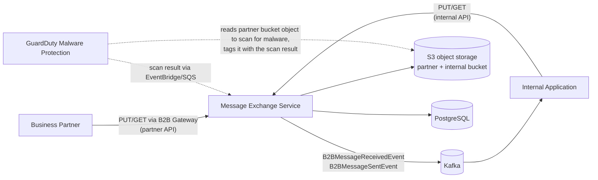
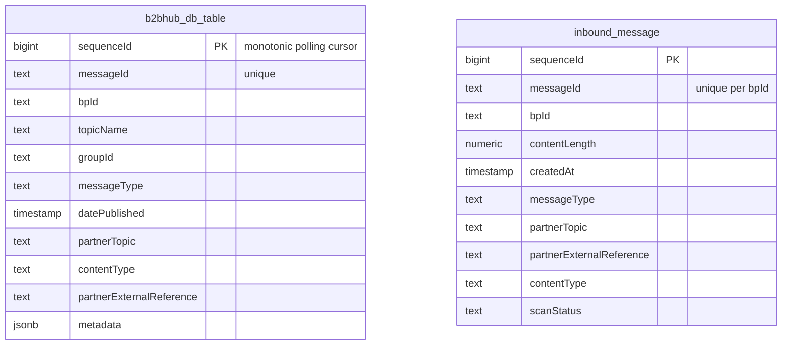

# Architecture

The Message Exchange Service (MES, also known as the successor of the "B2B Hub") exchanges messages with
business partners of federal offices asynchronously in both directions, using file-transfer-like semantics.
It is provided as a reusable jEAP microservice: teams instantiate and operate their own MES instance the same
way as other jEAP microservices. See [Getting Started](getting-started.md) for how to set up an instance.

## Goals and constraints

- **API compatibility.** The MES is a 1:1 replacement for the previous WSO2-based B2B Hub. Both the partner
  API and the internal API are fully compatible with the B2B Hub API, including paths, parameters and
  headers. Existing partner and internal clients work unchanged.
- **Persistence compatibility.** The database schema and the S3 storage structure of the B2B Hub are reused,
  enabling migration (and rollback) without data conversion.
- **Zero-downtime migration** from a consumer point of view.
- **Reliability and performance.** The MES handles high request rates (hundreds of thousands of requests per
  hour on the busiest instances, with roughly 150 times more reads than writes on the partner API).
- Messages are retained for a configurable period (14 days by default), then deleted
  (see [Operations](operations.md)).

## Context

Use cases are deliberately simple:

- A business partner **uploads** a message for an internal system (inbound).
- An internal system is **notified** via Kafka and **downloads** the message (inbound).
- An internal system **publishes** a message for a business partner (outbound).
- A business partner **polls** for and downloads new messages (outbound).

Partners authenticate with JWT tokens issued for the B2B gateway (business-partner roles); internal
applications use tokens from the system's Keycloak (user roles). See [REST API](rest-api.md#authorization).

## Building blocks

The service is a multi-module Maven project. An MES instance depends on
`jeap-message-exchange-service-instance` (plus optional adapters) and adds only configuration:

| Module | Responsibility |
| --- | --- |
| `jeap-message-exchange-domain` | Domain logic: `MessageExchangeService`, malware scan gate, legacy tag compatibility |
| `jeap-message-exchange-web` | REST controllers for the partner and internal API (v3/v4), streaming request/response handling |
| `jeap-message-exchange-persistence` | JDBC repositories and Flyway migrations (`b2bhub_db_table`, `inbound_message`) |
| `jeap-message-exchange-adapter-objectstorage` | S3 access (payloads, tags, lifecycle configuration) |
| `jeap-message-exchange-adapter-kafka` | Publishes `B2BMessageReceivedEvent` and `B2BMessageSentEvent` |
| `jeap-message-exchange-adapter-metrics` | Micrometer metrics (see [Operations](operations.md#monitoring)) |
| `jeap-message-exchange-adapter-malware-aws-s3` | Optional: consumes GuardDuty malware scan results from SQS |
| `jeap-message-exchange-malware-adapter-api` | SPI between the domain and malware scan adapters |
| `jeap-message-exchange-service-instance` | Aggregator artifact for MES instances |

## Data model

The relational model is intentionally minimal — payloads live in S3, the database holds metadata:

- `b2bhub_db_table` indexes **outbound** messages (internal application to partner). `sequenceId` provides
  the strictly increasing cursor used by partner polling.
- `inbound_message` records **inbound** messages (partner to internal application). Since 11.0.0 it is the
  single source of truth for inbound message metadata and the malware scan status
  (see [Malware Scanning](malware-scanning.md) and
  [the 11.0.0 upgrade notes](scan-status-in-database.md)).
- S3 objects: inbound payloads are stored in the partner bucket under the key `messageId`; outbound payloads
  in the internal bucket under `bpId/messageId`.
- Scan-status reads and updates target the newest `inbound_message` row for a `messageId` (greatest
  `createdAt`, ties broken by `sequenceId`) — the row owning the current S3 object, since every store and
  re-store refreshes `createdAt`.

## Runtime view

The upload, delivery, scan-result and polling flows — including their failure modes, transactional ordering
and idempotence — are documented in detail with sequence diagrams in [Message Flows](message-flows.md).

## Deployment

The MES runs in all jEAP-supported runtime environments (AWS, CloudFoundry, RHOS). A typical AWS
deployment consists of:

- Several stateless MES instances behind the platform ingress; partner traffic is routed through a B2B
  gateway that handles API subscriptions and tokens.
- An RDS PostgreSQL database. A single read replica may be enabled (`jeap.datasource.replica.enabled`) —
  reads that gate message delivery always use the primary, see
  [Message Flows](message-flows.md#transactional-concerns).
- Two S3 buckets (partner + internal) with **versioning disabled** (message versioning is not supported by
  the API, see [Malware Scanning](malware-scanning.md#scan-results-and-s3-object-versions)) and lifecycle
  rules managed by the MES.
- Optionally, GuardDuty Malware Protection on the partner bucket with the scan-result SQS queue consumed by
  the AWS malware scan adapter.

## Architecture decisions (summary)

- **Standard blocking Spring Boot web stack** — no reactive stack, no virtual threads. The MES is dominated
  by I/O against finite resources (database connection pool, S3); virtual-thread support in the involved
  client libraries was not mature enough to justify the risk. Concurrency is tuned via the Tomcat thread
  pool (300 by default) and horizontal scaling. Payloads up to a configurable threshold (default 1 MB) are
  buffered in memory so transient S3 errors can be retried; larger payloads are streamed without buffering
  and fail fast on an S3 error, relying on the client retrying the idempotent PUT.
- **No distributed cache, no CQRS.** PostgreSQL tuning, indexes and (optional) read replicas proved
  sufficient; caching (ElastiCache) remains a documented fallback option if load grows beyond that. CQRS was
  rejected because it would break persistence compatibility for no benefit over caching.
- **PostgreSQL instead of S3 tags as the source of truth for the inbound scan status** (11.0.0): S3 object
  tagging is a full-replace API and lost updates against GuardDuty's tagging were unavoidable. See
  [the 11.0.0 upgrade notes](scan-status-in-database.md) for the full reasoning and migration path.
