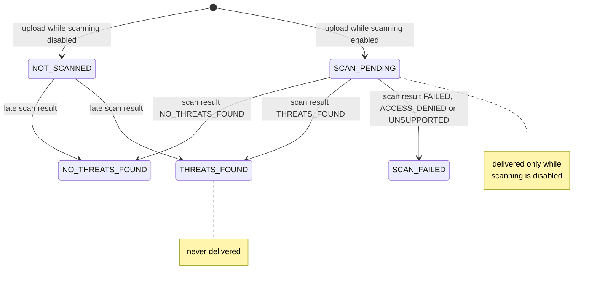
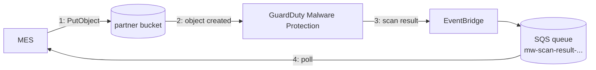

# Malware Scanning

Inbound partner messages can be scanned for malware before they are released to internal applications. The
MES itself does not scan anything — it stores the message, waits for a scan verdict from the platform (AWS GuardDuty
Malware Protection) and gates message delivery on that verdict.

For the exact flow, ordering and failure semantics see
[Message Flows](message-flows.md#inbound-malware-scan-result-processing). For the 11.0.0 change that moved
the scan status from S3 tags into PostgreSQL, see
[the upgrade notes](scan-status-in-database.md).

## Scan status lifecycle

The scan status of an inbound message is persisted on its `inbound_message` row:



Delivery gate: `NO_THREATS_FOUND` and `NOT_SCANNED` are always delivered, `THREATS_FOUND` never,
`SCAN_PENDING` and `SCAN_FAILED` only while `jeap.messageexchange.malwarescan.enabled=false`.

A `B2BMessageReceivedEvent` is published when the scan result arrives (or immediately at upload when
scanning is disabled). `THREATS_FOUND` is always published — even for a message already announced as
`NOT_SCANNED` — so consumers can revoke a previously released message.

## Scanning infrastructure on AWS



GuardDuty scans every newly created object in the protected bucket. The result is delivered through
EventBridge into an SQS queue that the MES polls (`jeap-message-exchange-adapter-malware-aws-s3`).

### Scan results and S3 object versions

The scan-result notification identifies the exact scanned content: besides `objectKey` and `bucketName` it
carries the `objectVersionId` and the `eTag` of the scanned object. **The MES correlates results by object
key only** and applies the verdict to the newest `inbound_message` row for that key; version id and eTag are
ignored. This is watertight under the documented operating conditions:

- **Bucket versioning must be disabled** on the MES buckets (message versioning is not supported by the
  API; the S3 lifecycle rules of the MES also assume unversioned buckets). Without versioning, a key always
  refers to exactly one — the latest — content, and `objectVersionId` is null in the notifications.
- **One upload, one scan, one result.** GuardDuty scans per object-creation event. A duplicate upload with
  identical content is not written again and triggers no second scan.
- **A re-stored message cannot meet a stale in-flight result.** A message is only stored again under its key
  when the original object is gone — at the earliest after the retention period (15+ days), while scan
  results arrive within seconds and the SQS retention is at most 14 days. The row is additionally reset to
  `SCAN_PENDING` *before* the new object is written, so the new content is fail-closed until its own result
  arrives.

## Configuring malware scanning (AWS)

Order matters when enabling: **first** enable the platform scanning on the bucket, **then** the MES module —
otherwise messages get stuck in `SCAN_PENDING` because no scan result ever arrives. Enable the MES side soon
after the bucket side, or unprocessed results accumulate in the queue.

1. Enable the platform's malware scanning on the MES partner bucket:

   ```json
   "your-mes-partner-bucket-configuration": {
     "bucket_name": "your-mes-partner-bucket-name",
     "malware_scanning_enabled": true
   }
   ```

2. Add the AWS scanning adapter to your MES instance:

   ```xml
   <dependency>
       <groupId>ch.admin.bit.jeap</groupId>
       <artifactId>jeap-message-exchange-adapter-malware-aws-s3</artifactId>
   </dependency>
   ```

3. Configure and enable it:

   ```yaml
   jeap:
     messageexchange:
       malwarescan:
         enabled: true
         aws-s3:
           sqs-queue-url: "https://sqs.<region>.amazonaws.com/<account-id>/mw-scan-result-<bucket-name>"
           restrict-notifying-malware-scan-results-to-buckets:
             - "${jeap.messageexchange.objectstorage.connection.bucket-name-partner}"
   ```

Messages uploaded between enabling the bucket scanning and enabling the MES scanning are published as
`NOT_SCANNED` and are accessible; a later `THREATS_FOUND` result still blocks them and publishes a
revocation event.

### Advanced adapter options

Properties under `jeap.messageexchange.malwarescan.aws-s3`:

| Property | Description | Default |
| --- | --- | --- |
| `sqs-queue-url` | URL of the scan result queue (mandatory) | — |
| `restrict-notifying-malware-scan-results-to-buckets` | Only process results for these bucket names | empty = no restriction |
| `sqs-access-key-id` / `sqs-secret-access-key` | Static SQS credentials | default AWS credentials provider chain |
| `sqs-endpoint-url` / `sqs-region` | SQS endpoint/region overrides | AWS defaults |
| `sqs-http-proxy-use-externally-defined-settings` | Use externally defined HTTP proxy settings for the SQS client | `false` |

## Disabling malware scanning

Order matters again — reverse of enabling, so that in-flight scan results are still processed:

1. Set `jeap.messageexchange.malwarescan.enabled=false` and restart the MES. Messages in `SCAN_PENDING`
   become deliverable once scanning is disabled.
2. Leave the `jeap-message-exchange-adapter-malware-aws-s3` dependency in place for a while (a day is safely
   enough) so the MES catches up with scan results for messages received while scanning was still on — those
   results publish the `B2BMessageReceivedEvent` for messages that were still pending.
3. Remove the dependency and redeploy.
4. Disable the platform's malware scanning on the bucket (this deletes the queue including unprocessed results).

When **re-enabling**, first verify that there is no consumer lag and no processing errors for
`B2BMessageReceivedEvent` — events for messages left in `SCAN_PENDING` at disable time must have been
processed before results start arriving again.

## Compatibility and healing (versions before 11.0.0)

Until 11.0.0 the scan status lived in S3 object tags; since 11.0.0 the database is the single source of
truth. During the transition, [legacy tag compatibility](scan-status-in-database.md) keeps the MES < 11
tagging behavior alive (default on, disable after the fleet upgrade):

- New objects still carry the MES < 11 metadata tags, written atomically at creation.
- Scan results still update the `scanStatus` tag (best effort, after the database update).
- Messages stored by older versions are read through a read-only tag fallback; their database row is
  backfilled when a scan result arrives.
- A row stuck in `SCAN_PENDING` whose scan result was processed by an MES < 11 instance (tag updated, database
  not) is healed from the terminal `scanStatus` tag on its next retrieval.

Messages stuck in `SCAN_PENDING` from the historic GuardDuty tagging race are **not** healed automatically —
see the [manual repair instructions](scan-status-in-database.md#what-changed) in the upgrade notes.
