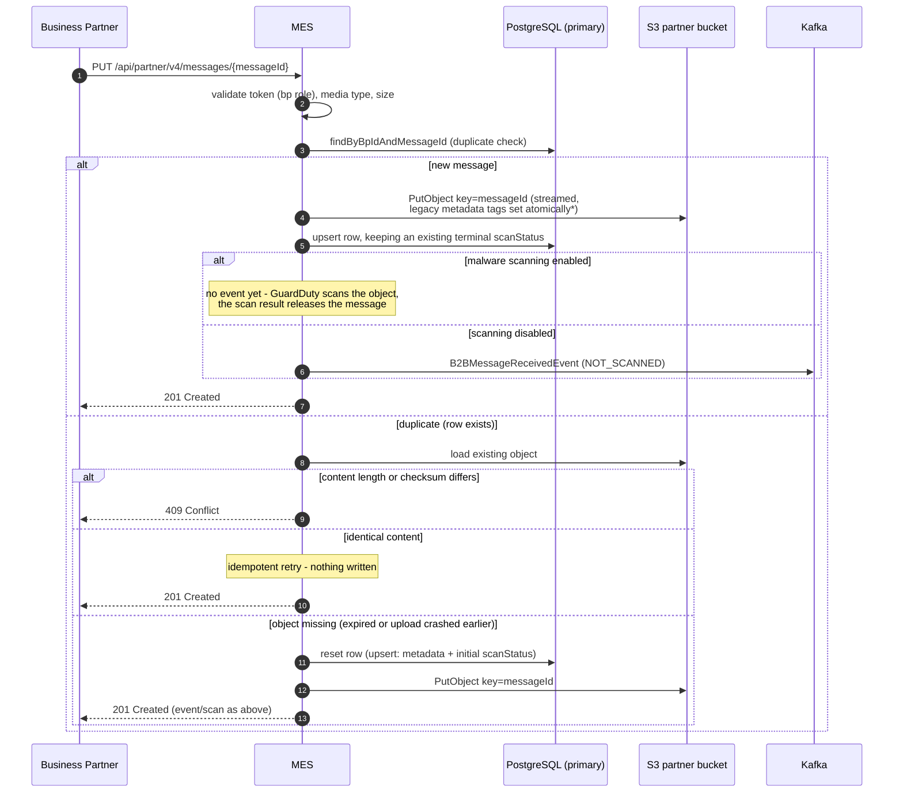
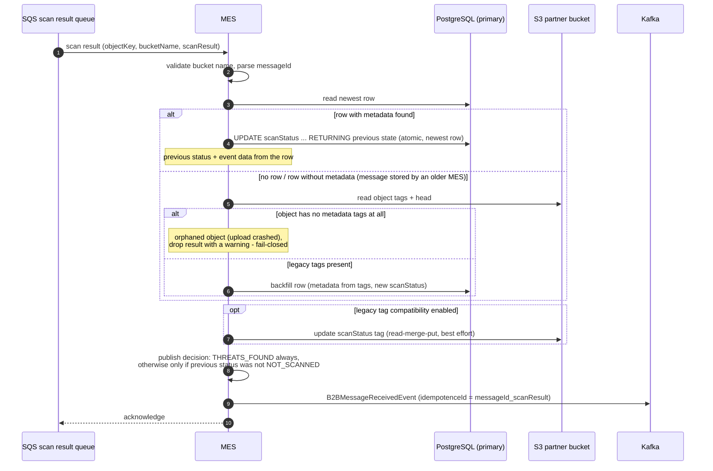
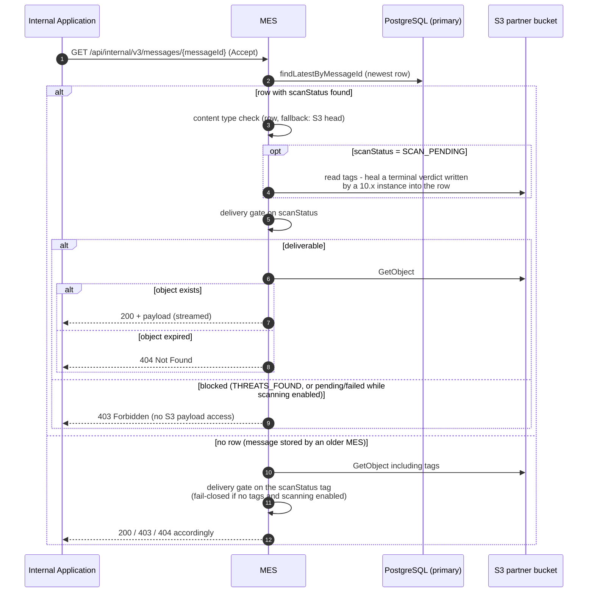
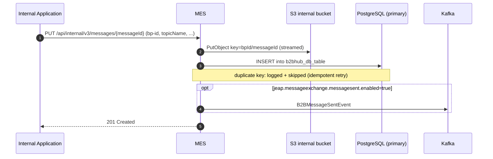
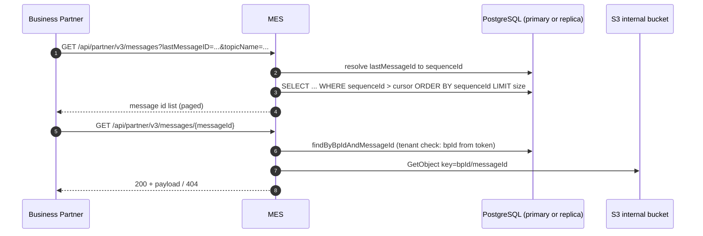

# Message Flows

This page documents the runtime behavior of the MES: the upload and delivery paths for inbound and outbound
messages, the malware scan result processing, and — most importantly — the **failure modes**, the
**transactional ordering** between S3, PostgreSQL and Kafka, and how **fail-safety and idempotence** are
achieved without distributed transactions.

Terminology: *inbound* = business partner to internal application (partner bucket, `inbound_message` table);
*outbound* = internal application to business partner (internal bucket, `b2bhub_db_table`).

## Design principles

There is **no distributed transaction** spanning S3, the database and Kafka. Instead, every flow

1. writes in a fixed order chosen so that each crash window leaves the system in a *fail-closed* or
   *retry-safe* state,
2. makes every write idempotent (upserts, insert-or-skip, atomic compare-and-set updates), so that client
   retries and at-least-once message delivery converge to the same result, and
3. publishes Kafka events only *after* the state they announce has been committed to the database, so a
   consumer reacting to an event immediately sees consistent state.

## Inbound: partner uploads a message (PUT)

*Legacy metadata tags are written only while
[legacy tag compatibility](scan-status-in-database-11.0.0.md) is enabled, and always atomically within the
`PutObject` request — never with a separate tagging call that could race with GuardDuty.

### Ordering: why S3 before the database for new messages — but not for re-stores

- **New message: S3 put first, row second.** The XML payload (v3 API) is validated *while* streaming to S3.
  If the row were written first and the upload then failed, the leftover row would break the partner's retry
  with corrected content: the duplicate check rejects a changed content length with 409. Writing the object
  first means a failed upload leaves *no row* and the retry runs as a fresh upload.
- **Re-store: row reset first, S3 put second.** When the row already exists but the object is missing, the
  row (possibly carrying a terminal scan verdict for the *old* content) is reset to the initial scan status
  *before* the new object is stored. A malware scan result for the new object can therefore never be
  reverted by the reset. If the put fails, the row is pending without an object — fail-closed, and safe to
  retry because the re-store path requires an unchanged content length anyway.
- **The row exists before the scan is triggered**, because the scan result handler reads it.

### Failure modes (inbound upload)

| Crash window                                  | Resulting state                                                          | Recovery                                                                                                                                                                                                                                                                                                                              |
|-----------------------------------------------|--------------------------------------------------------------------------|---------------------------------------------------------------------------------------------------------------------------------------------------------------------------------------------------------------------------------------------------------------------------------------------------------------------------------------|
| During streaming/XML validation               | Nothing persisted (new message) or pending row without object (re-store) | Partner retries; both states accept a fresh upload                                                                                                                                                                                                                                                                                    |
| After S3 put, before row upsert (new message) | Object without database row                                              | Delivery stays fail-closed (403 while scanning is enabled). With legacy tag compatibility **on**, the scan result backfills the row from the object tags and releases the message. With compatibility **off**, the scan result for the orphaned object is dropped with a warning; the partner's retry re-uploads and creates the row. |
| After row upsert, before event/scan trigger   | Row + object consistent                                                  | On AWS, GuardDuty scans on object creation independently of the MES trigger, so the scan result still arrives and publishes the event. With scanning disabled, the `NOT_SCANNED` event is lost if the client treats 5xx as success — partners must retry non-2xx responses.                                                           |

A scan result that is processed *between* the S3 put and the row upsert of a new message (the scan pipeline
beating one insert) is not lost either: the legacy fallback backfills a row with the terminal verdict, and
the upload's upsert **keeps an existing terminal scan status** instead of downgrading it to `SCAN_PENDING`.

## Inbound: malware scan result processing

See [Malware Scanning](malware-scanning.md) for the scanning infrastructure and configuration.

Key properties:

- The status update is a single atomic `UPDATE ... RETURNING` statement that locks the newest row and
  returns the *previous* scan status — the basis for the event-suppression decision — without a read-then-
  write race between concurrent scan results.
- The database is updated **before** the transitional tag update and the event: the tag update is best
  effort (a failed S3 tagging call is logged and never loses the event), and a consumer that reacts to the
  event is guaranteed to see the committed scan status (see below).
- **Error handling is deliberately swallow-and-acknowledge**: exceptions thrown by scan result processing
  are logged at error level and the SQS message is acknowledged. There is no redelivery loop; a lost result
  leaves the message fail-closed in `SCAN_PENDING` (visible in the logs and via the
  `jeap_mes_malware_scan_result_counter` metric). The status is therefore only committed once the event data
  is available — for rows without metadata it is resolved from the S3 tags *first* — so a swallowed failure
  never leaves a deliverable message whose received event was lost.
- Scan results for objects that have neither a database row nor legacy metadata tags (an upload that crashed
  before writing its row, with legacy tag compatibility disabled) are **dropped with a warning** — the
  message is undeliverable anyway and the queue must not accumulate poison messages.

## Inbound: internal application downloads a message (GET)

The delivery gate: `THREATS_FOUND` is never delivered; `NO_THREATS_FOUND` and `NOT_SCANNED` are always
delivered; `SCAN_PENDING` and `SCAN_FAILED` are delivered only while malware scanning is disabled. A blocked
message is rejected from the database status alone — even after its S3 object expired (403, not 404), which
is why inbound rows are retained longer than their objects (see [Operations](operations.md#housekeeping)).

## Outbound: internal application publishes a message (PUT)

The insert assigns the `sequenceId` that makes the message visible to partner polling — S3 is written first
so that a message is never listed before its payload exists.

### Failure modes (outbound publish)

| Crash window | Resulting state | Recovery |
| --- | --- | --- |
| During S3 put | Nothing persisted | Client retries |
| After S3 put, before insert | Object without row — invisible to polling | Client retries: object is overwritten, row inserted |
| After insert, before event | Message fully visible to partner polling; `B2BMessageSentEvent` missing | Client retries: object overwritten, insert skipped (duplicate key), event published |

## Outbound: partner polls and downloads messages (GET)

Polling uses `sequenceId` as a strictly monotonic cursor: the partner passes the last message id it has seen
and receives everything after it, in publication order. Repeating a poll with the same cursor is naturally
idempotent.

## Transactional concerns

### Primary vs. replica database reads

With `jeap.datasource.replica.enabled=true`, reads annotated for replica routing go to an Aurora read
replica. The MES routes **every read whose answer gates correctness to the primary**, and only tolerant,
repeating reads to the replica:

| Read | Routing | Why |
| --- | --- | --- |
| Inbound duplicate check on upload | Primary | Read-after-write: a retried upload must see the row written by the previous attempt |
| Inbound delivery gate (`findLatestByMessageId`) | Primary | The scan status is committed immediately before the `B2BMessageReceivedEvent` is published; consumers retrieve the message right after the event — replica lag would cause spurious 403s |
| Outbound polling, outbound downloads | Replica allowed | Polling repeats; replica lag only delays visibility of new messages by one poll cycle, the monotonic cursor guarantees nothing is skipped |

### Write ordering summary

| Flow | Order | Rationale |
| --- | --- | --- |
| Inbound upload (new) | S3 put → row upsert (keeping terminal status) → event/scan | No leftover row on failed upload; racing scan verdicts are never downgraded |
| Inbound upload (re-store) | Row reset → S3 put → event/scan | A verdict for the new content can never be reverted by the reset; failure is fail-closed |
| Scan result | DB status update → transitional tag update (best effort) → event | Event announces committed state; tag write cannot lose the event |
| Outbound publish | S3 put → row insert → event | A message is never pollable before its payload exists |

### The newest-row invariant

Every store and re-store of an inbound message refreshes the row's `createdAt`, and all scan-status reads
and updates target the *newest* row (greatest `createdAt`, ties broken by `sequenceId`) — the row that owns
the current S3 object.

## Idempotence

| Interaction | Mechanism |
| --- | --- |
| Partner upload retry | Duplicate check + content-length/checksum comparison: identical content is accepted without any write; changed content is rejected with 409 |
| Internal publish retry | S3 overwrite (same key, same content) + insert-or-skip on duplicate key |
| Scan result redelivery (SQS is at-least-once) | The atomic status update simply re-applies the same value; the event carries `idempotenceId = messageId_scanResult`, so consumers deduplicate |
| Repeated `B2BMessageReceivedEvent` | A message can legitimately produce more than one event (e.g. `NOT_SCANNED` at upload and `THREATS_FOUND` from a later scan). Consumers must deduplicate on the idempotence id and treat `THREATS_FOUND` as a revocation |
| Partner polling | Monotonic `sequenceId` cursor; repeating a request returns the same page |
| Housekeeping | Batched deletes by expiry predicate; re-running deletes nothing extra ([Operations](operations.md#housekeeping)) |
